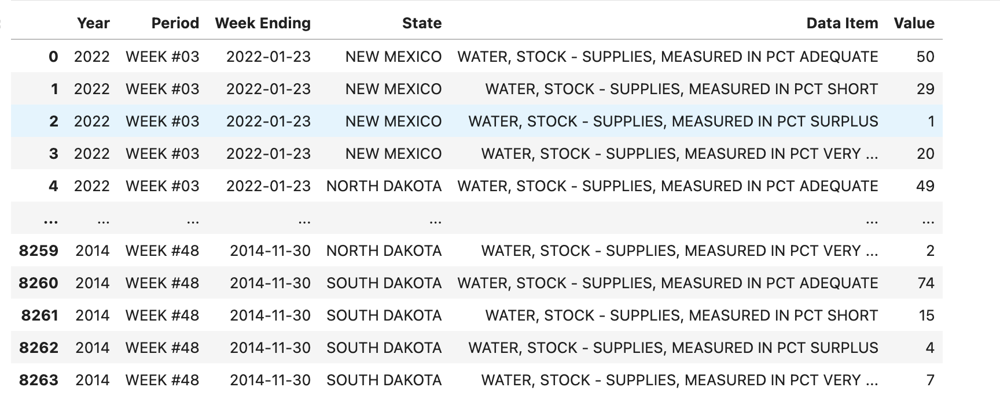
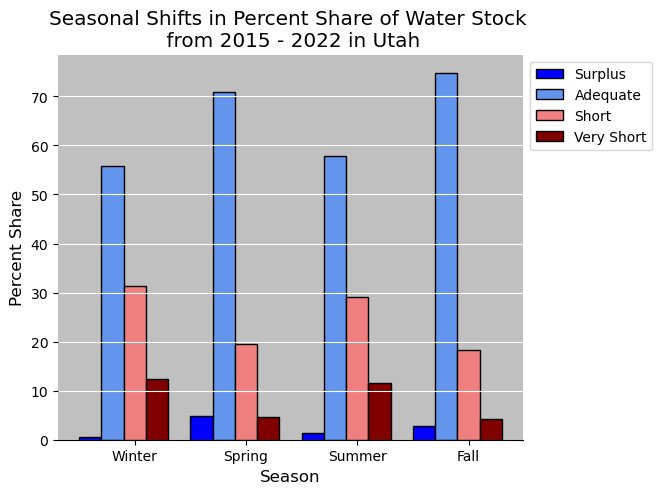
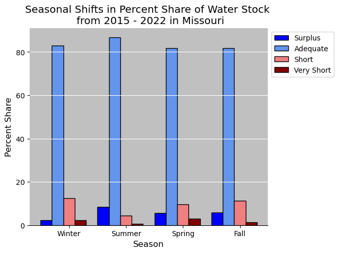
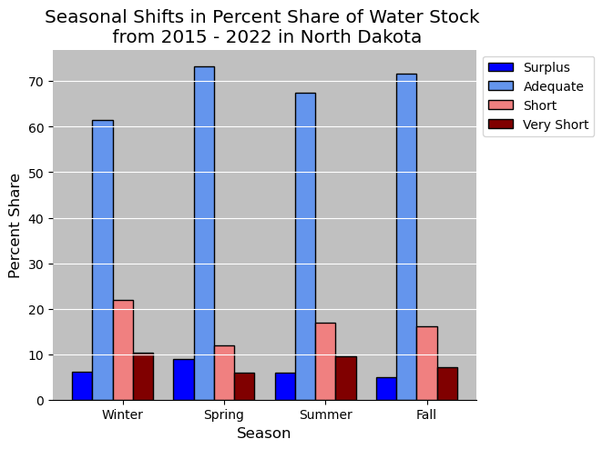

# Water Stock Analysis

-------

## What's Water Stock??

Farms across the United States that have or attend to cattle have access to water stock systems (public or private). These [water stock systems](https://www.usgs.gov/mission-areas/water-resources/science/livestock-water-use) can be at various levels: Surplus, Adequate, Short, and Very Short. 

We attempt to highlight trends in water stock levels across the states of Missouri, North Dakota, New Mexico, Utah, and Wyoming. The goal of the analysis is to identify which states are at risk, if at all, of lower water stock levels. Specifically, we hope to identify any states where more often than not, their water stock systems are at low levels or going towards that way.

### Data:

The data for this project comes for the [United Stated Department of Agriculture Department of Agriculture National Agricultural Statistics Service](https://quickstats.nass.usda.gov/). The data is recorded in a csv where you have the the state, the given week, the given water stock level, and the percentage of water stock systems at the level for that given week within that state. An example is depicted below.

  

From here, we proceed with individual processing as relevant for each objective. 

--------

## Seasonal Shifts:

When looking at the problem seasonally, we aim to capture the average percentage of water stock systems at each level for each season. The hope is that we do not notice any major change in percentage share of each level between seasons. For example, we would adequate to be at X% every season (and the same for every other stock level). This would imply that the differences between seasons do not impact the changes of water stock level percentages. 

### Results & Figures

  
   
  
  
  

The most important thing to notice from this image is that regardless of season, most water stock systems are, on average, at an adequate level. However there is some fluctuation to be noted. 

On a specific state level, we see that more of Utah's water stock systems are at short or super short during more extreme seasons like winter and summer at the cost of those at the amouunt at an adequate level going down. This also applies to North Dakota and Wyoming. For Missouri there is less of a change in percentages at given water stock levels across seasons. Though interestingly enough, we see that the surplus level increases past the short level in the summer, meaning that more water stock systems are at surplus during the summer in Missouri than are at short. Unfortunately, New Mexico seems to be at the greatest risk though, given that a greater portion of each season is at short/super short when compared to other states. But again, there is little fluctuation. 

Overall, seasons can have an effect, but they do not seem to drastically change the rank order of the water stock levels.

## Annual Percent Share

Next we looked at the average share of water stock levels per week for the past 7 years. The original dataset does not contain the exact information, so to accomplish this we created new arrays to store the necessary information.

### Average Annual Water Supply 

For each state, we isolated the supply level percents for each week of the year and summed the results; we then divided this by 100 multiplied by the total number of weeks in that year. This would give us the average percentage of each supply level shared with the other supply levels for each year. For instance, to calculate the adequate supply level for New Mexico, we used the following code:

<code>
  ad_percents = []
   
  for years in x:
   
      ad_percents.append(np.round(y_ad.loc[y_ad['Year']==years].sum(axis=0)['Percent Value']/
                          df_nm.loc[df_nm['Year']==years].sum(axis=0)['Percent Value']*100,2))
</code>
