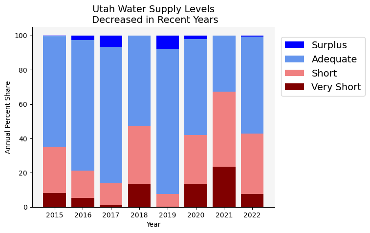
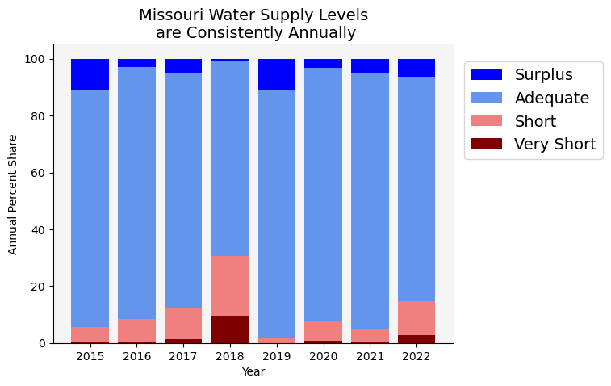
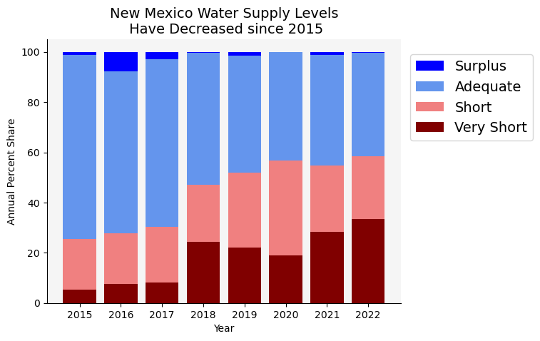
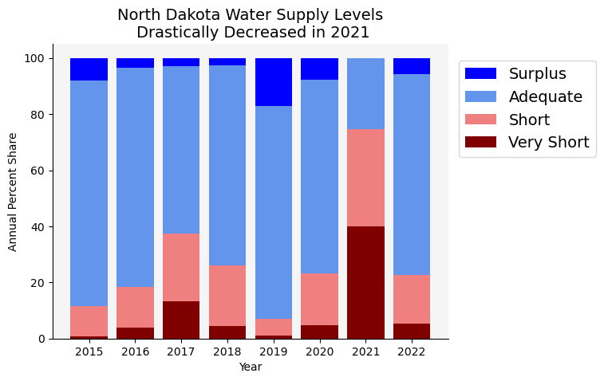
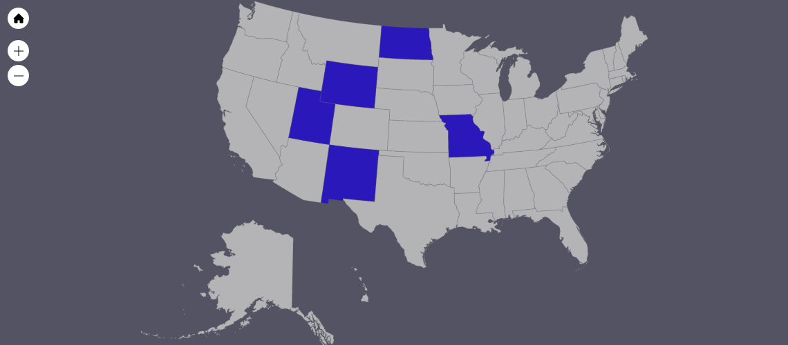

# Water Stock Analysis

-------

## What's Water Stock??

Farms across the United States that have or attend to cattle have access to water stock systems (public or private). These [water stock systems](https://www.usgs.gov/mission-areas/water-resources/science/livestock-water-use) can be at various levels: Surplus, Adequate, Short, and Very Short. 

We attempt to highlight trends in water stock levels across the states of Missouri, North Dakota, New Mexico, Utah, and Wyoming. The goal of the analysis is to identify which states are at risk, if at all, of lower water stock levels. Specifically, we hope to identify any states where more often than not, their water stock systems are at low levels or going towards that way.

### Data:

The data for this project comes for the [United Stated Department of Agriculture Department of Agriculture National Agricultural Statistics Service](https://quickstats.nass.usda.gov/). The data is recorded in a csv where you have the the state, the given week, the given water stock level, and the percentage of water stock systems at the level for that given week within that state. An example is depicted below.

  

From here, we proceed with individual processing as relevant for each objective. 

--------

## Seasonal Shifts:

When looking at the problem seasonally, we aim to capture the average percentage of water stock systems at each level for each season. The hope is that we do not notice any major change in percentage share of each level between seasons. For example, we would adequate to be at X% every season (and the same for every other stock level). This would imply that the differences between seasons do not impact the changes of water stock level percentages. 

### Results & Figures

  
   
  
  
  

The most important thing to notice from this image is that regardless of season, most water stock systems are, on average, at an adequate level. However there is some fluctuation to be noted. 

On a specific state level, we see that more of Utah's water stock systems are at short or super short during more extreme seasons like winter and summer at the cost of those at the amouunt at an adequate level going down. This also applies to North Dakota and Wyoming. For Missouri there is less of a change in percentages at given water stock levels across seasons. Though interestingly enough, we see that the surplus level increases past the short level in the summer, meaning that more water stock systems are at surplus during the summer in Missouri than are at short. Unfortunately, New Mexico seems to be at the greatest risk though, given that a greater portion of each season is at short/super short when compared to other states. But again, there is little fluctuation. 

Overall, seasons can have an effect, but they do not seem to drastically change the rank order of the water stock levels.

## Annual Percent Share

Next we looked at the average share of water stock levels per week for the past 7 years. The original dataset does not contain the exact information, so to accomplish this we created new arrays to store the necessary information.

### Average Annual Water Supply 

For each state, we isolated the supply level percents for each week of the year and summed the results; we then divided this by 100 multiplied by the total number of weeks in that year. This would give us the average percentage of each supply level shared with the other supply levels for each year. For instance, to calculate the adequate supply level for New Mexico, we used the following code:

<pre>
  <code>
  ad_percents = []
  
  for years in x:   
        ad_percents.append(np.round(y_ad.loc[y_ad['Year']==years].sum(axis=0)['Percent Value']/
        df_nm.loc[df_nm['Year']==years].sum(axis=0)['Percent Value']*100,2))
  </code>
</pre>

### Results and Figures

  
   
  
  
  

Apart from Missouri, there is a noticable decline in water supply in recent years for 4 of the 5 states. 2021 in particular saw very short annual water supplies relative to the other years. Interestingly, Missouri does not display the same trend of declining water supply, perhaps due to its more eastern geographic location compared to the other states examined. We later discuss potential causes for the recent water shortages.

## Most Common Weekly Levels

The dataset contains a weekly breakdown of each state’s waterstock level by percentage. The data in the charts reflects the level with the highest percentage for each week. 

### Results and Figures

  
  
  
  
  

Missouri has the most consistent water stock levels, as they did not record a single week where "adequate" was not the highest level. North Dakota had one of the most severe shortages in 2021, where "very short" was the highest level for over 60% of weeks in the year. The trends in the data suggest that prior to 2018, the majority of farms across each state had adequate amounts of water for their livestock. The majority of the problems for farms have come in the last four years, with all states except for Missouri having higher occurrences of farms recording "short" or "very short" levels. Although many farms in each state had occurrences of surpluses, "surplus" was never the level with the maximum number of occurrences in a given week.

## Causes of Water Shortages
<a href="https://www.nationalgeographic.com/science/article/partner-content-americas-looming-water-crisis">America is running out of water</a>. The image below shows the states included in our data, which are all located in south and midwestern United States.

  

The data collected aligns with sources that claim many of these southwest and midwestern states are <a href="https://www.drought.gov/news/how-drought-prone-your-state-look-top-states-and-counties-drought-over-last-two-decades"> vulnerable to droughts and water shortage</a>, likely due to low flows and amounts in bodies of water, dry soils, lack of snow, higher evaporative losses, etc.
 
 
Moreover, the primary belief is that <a href="https://agupubs.onlinelibrary.wiley.com/doi/10.1029/2018EF001091">population growth and climate change </a> are impacting precipitation levels globally. While 2022 may have seen higher levels of water than 2021, scientists hypothesize that the water crisis will only increase in severity with time, unless something fundamental is changed about American water usage.
 
 

## Impact

Water intake is very <a href="https://www.ksvdl.org/laboratories/toxicology/Livestock-Water-Quality-Ensley-2020-web.pdf"> crucial for livestock </a>, and limited water levels can result in poor animal performance, stress, and dehydration. Most domesticated animals can survive for close to sixty days without food, but only seven days without water. Cows specifically can drink three to five gallons of water per minute. Missouri and North Dakota are in the top fifteen states with the most cattle, and the availability of water to the animals is crucial to their health.

The raising of cattle accounts for 23% of all water consumption in the United States, primarily because of the water required to grow crops that feed the cattle. Many lakes and rivers in the Colorado river basin have dried up, and much of this decline can be attributed to cattle-feed irrigation like alfalfa and grass hay. Although this problem will likely continue to grow,<a href="https://www.nature.com/articles/s41893-020-0483-z)"> research </a> suggests that temporarily fallowing the farmland, or not growing anything on it for an extended period of time, can markedly reduce water shortage risks.
